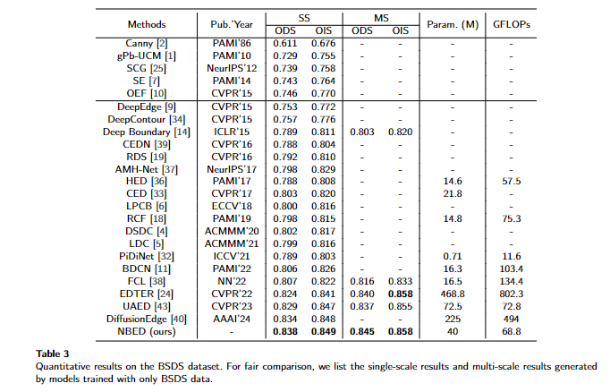
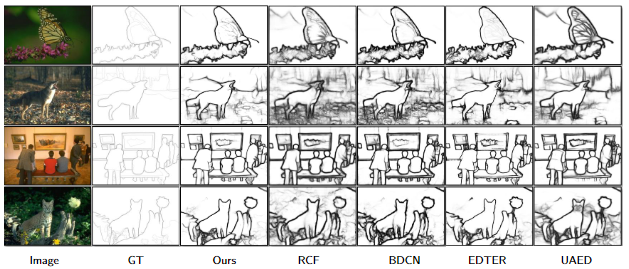

# NBED
Code of paper "A new baseline for edge detection: Make Encoder-Decoder great again"

## Test NBED  
Modify the values of ckpt and img in inference.py. ckpt on BSDS can be found from 
https://drive.google.com/file/d/1TKg37m3KWuv4A8FTlXJ-N20Ar46PmRdH/view?usp=sharing
And running command
```
python inference.py
```

## Training NBED
### Preparing the dataset
Download the dataset to any dir and point to the dir in the code  
-BSDS500 following the setting of "The Treasure Beneath Multiple Annotations: An Uncertainty-aware Edge Detector"  
-NYUDv2 following the setting of "Pixel Difference Networks for Efficient Edge Detection"  and random crop to 400*400  
-BIPED following the setting of "Dense Extreme Inception Network for Edge Detection"  
### Preparing the pretrained weights
Down it from https://huggingface.co/sail/dl/resolve/main/caformer/caformer_m36_384_in21ft1k.pth
and put it into the dir ./model
### Training NBED
```
python main.py --batch_size 4 --stepsize 3-4 --gpu 1 --savedir 0305-bsds --encoder Dul-M36 --decoder unetp --head default --note 'training on BSDS500' --dataset BSDS --maxepoch 6
```
### Eval NBED
Following the previous methods. such as RCF and PiDiNet




The result of BSDS500 can be download here
https://drive.google.com/file/d/1PiPklsH7w6zNxdGWW-JpnUsFOdiYLHwG/view?usp=sharing

##UPDATE  
checkpoint on BIPED is [here](https://drive.google.com/file/d/1IJO3VYrzi1Rp6YS4CzawZTrggxzz5cBx/view?usp=drive_link)
ODS/OIS on BIPED is a little arror, due to a wrong tolerate is used. And it is coeercted in [version 2](https://arxiv.org/pdf/2409.14976) 
